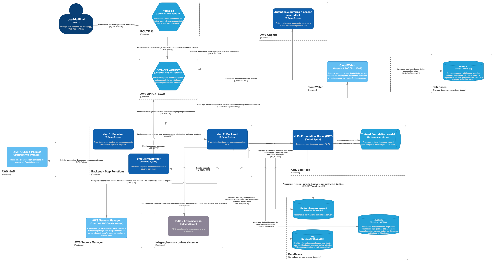

# FIAP - Faculdade de Informática e Administração Paulista

<p align="center">
<a href= "https://www.fiap.com.br/"></a>
</p>

<br>

### Enterprise Challenge - Sprint 1 - Solubio

# Grupo 52


## 👨‍🎓 Integrantes: 
- <a href="https://www.linkedin.com/in/caiorcastro/">Caio Rodrigues Castro</a> 
- <a href="https://www.linkedin.com/in/ederson-badeca/">Ederson Luiz Badeca dos Santos</a> 
- <a href="https://www.linkedin.com/in/digitalmanagerfelipesoares/">Felipe Soares Nascimento</a>
- <a href="https://www.linkedin.com/in/lfhillesheim/">Lucas Ferreira Hillesheim</a>

## 👩‍🏫 Professores:
### Tutor(a) 
- <a href="https://www.linkedin.com/in/lucas-gomes-moreira-15a8452a/">Lucas Gomes</a>
### Coordenador(a)
- <a href="https://www.linkedin.com/in/profandregodoi/">André Godoi Chiovato</a>

## 📜 Descrição
## Chatbot Dra. Jô - Solução de Atendimento Inteligente
Este projeto implementa uma solução de chatbot baseada em IA para a Dra. Jô, idealizada para otimizar e automatizar o atendimento ao cliente. O chatbot é construído sobre uma arquitetura escalável e segura, utilizando tecnologias de IA e NLP da AWS para oferecer uma experiência de atendimento personalizada e eficiente.


## Objetivos
O objetivo deste chatbot é oferecer suporte inteligente para clientes da Dra. Jô, viabilizando atendimentos automatizados, agendamentos, orientação sobre produtos, e suporte técnico. A arquitetura considera a escalabilidade necessária para atender um grande número de clientes com segurança e foco na experiência do usuário.

## Detalhamento da arquitetura escolhida
Para ter mais detalhes sobre a arquitetura escolhida, por favor acesse a [nossa ADR](./document/ADR.md)

## Estimativa de custos
Clique [aqui para visualizar a estimativa de custos](./document/custos.pdf)

# Escolha do C4 Model

A arquitetura do chatbot da Dra. Jô foi desenhada usando o (C4 Model)[https://c4model.com/) devido à sua clareza e capacidade de representar sistemas complexos de maneira compreensível e modular. O C4 Model oferece quatro níveis de abstração que ajudam a capturar tanto a visão geral quanto os detalhes técnicos da solução, adequados para comunicar efetivamente com diferentes públicos, desde stakeholders de negócios até desenvolvedores técnicos. Os motivos específicos para a escolha incluem:

1. **Clareza e Organização**: O C4 Model permite descrever a arquitetura em quatro níveis de detalhe: Contexto, Contêineres, Componentes, e Código. Essa abordagem facilita o entendimento de cada camada do sistema, desde a visão geral até as especificidades dos componentes, mantendo a estrutura organizada e fácil de seguir.

2. **Adaptabilidade para Diferentes Públicos**: Cada nível do C4 Model é projetado para fornecer o nível de detalhe certo para públicos distintos. Para stakeholders e equipes de negócios, o diagrama de contexto oferece uma visão macro, destacando a interação do sistema com usuários e sistemas externos. Para equipes de desenvolvimento, os diagramas de contêineres e componentes trazem os detalhes necessários sobre como cada parte da arquitetura funciona e se comunica.

3. **Documentação Clara e Consistente**: O C4 Model é amplamente utilizado para criar documentação arquitetural clara e sustentável, que pode ser facilmente atualizada conforme o sistema evolui. Isso é essencial para garantir que a arquitetura do chatbot possa ser mantida e compreendida no longo prazo, à medida que a solução é aprimorada.

4. **Escalabilidade e Manutenção**: O C4 Model nos permite visualizar as dependências entre os componentes e identificar facilmente como o sistema poderá escalar para atender a um número crescente de usuários e novas funcionalidades. Além disso, a modularidade que o modelo proporciona facilita a manutenção e o crescimento da solução, incluindo novos contêineres e componentes sem comprometer a arquitetura global.

5. **Foco em Segurança e Estrutura Modular**: Com uma representação clara de contêineres e componentes, o C4 Model ajuda a mapear pontos críticos de segurança e a identificar quais serviços devem ser protegidos e monitorados. Esse recurso é fundamental para garantir que a solução esteja alinhada às diretrizes de segurança e privacidade, como a LGPD.

---

A escolha do C4 Model foi, portanto, estratégica para comunicar a complexidade técnica da arquitetura de forma intuitiva, promovendo uma colaboração mais eficaz entre todas as partes envolvidas no desenvolvimento do chatbot da Dra. Jô.

# O Diagrama de arquitetura
<p align="center">
</a>
</p>

## Usando o diagrama
para usar o diagrama siga os seguintes passos

1. Clone o repositório
```shell
git clone <repo-url>
```
2. Acesse https://www.drawio.com/
3. Crie um novo diagrama em branco
4. Importe o arquivo [chatbot-dra-jo.drawio](./src/chatbot-dra-jo.drawio)

### Acessando a URL Publica
você também pode visualizar o diagrama acessando esta URL:
[chatbot-dra-jo.draw.io](https://app.diagrams.net/?title=Diagrama%20sem%20nome.drawio#R%3Cmxfile%3E%3Cdiagram%20name%3D%22System%20Context%22%20id%3D%22CaJh-Bn7c98b0ytrD74R%22%3E7V3ZduM2tv0ardX9YC3OFB%2FlqVJ9qypuy911c99oCZaYokgVSbnsfP09mDiAs6jRgZM4JkSCIATufSacM9Jv1m%2BfInez%2BhoukD%2FSlMXbSL8daZrhGBb8D7e80xbNtmzasoy8BW1Ts4aZ9xdijQpr3XoLFBdOTMLQT7xNsXEeBgGaJ4U2N4rCX8XTXkK%2FeNeNu0Slhtnc9cut371FsqKtE83O2n9D3nLF76xaDv1k7fKT2ZPEK3cR%2Fso16Xcj%2FSYKw4T%2BtX67QT6ePT4v9Lr7mk%2FTgUUoSCouCJ%2F%2FxPMBZ%2FjuHK3guVEkTJnxzV2zx%2FxPvB3d6KOpGnkhfHTvBa7Pz3p637CzHqCLMODttyieR94m8aCJfPw5SFCE5xN%2FHWv4jbuar9zkOcQDefVc%2BP0djuPpZjPSbvAReobf5FAJt%2FhPH7259A6%2B%2BwyrifQ80iwfHvL6JQxwT3Hyzr4f6%2Bc25B9cxWT1TOEE1dq8ZR%2FCX0v2f9LLc9ZgsknQTP4hTOCzeAG00TsXmxfea9pk0s7IXEFn5m3u2vx5fAhRU2d9n1ZtelrWyzz0w6jQy0jT5%2BSn6lqz%2BP0W5qdqLsTH1HJL9b%2FfFvf65P1mMbt%2B%2BvPX02P46bt6paWvQLq0swfVVskaf%2FUqGz%2FDBRUfL9x4hXDPChz8WnkJmm1ghUPDL8AgfIHn%2Bzfp0%2BrKRL%2B3TWiPkyj8gfKfWLpq3rBb5NpfyA%2B%2BYuWSpb9%2BW2J4G8%2BN8Ya8AjDya9f3lnjhzxFe9tCwRol7t%2FASNu5N6AUJeeNMvDyUMUzhjUL%2Bw6vjBtpUfMTai212sZE1qEJjVZtW0VjZZfHe8K9%2BHSFYVO4z%2BRKU9GvMQwyDjlcUJegt18S%2ByE8ohFmI3uEU9umVOWH4xxjgKgXEXxmeagprW%2BWxlF%2FpMtxapr1nMAd%2FsPXDDxnwVaNm5VJkHPXq%2BlvE8UYrrsdlFG433acj5SM2mQXIr5omSxFnySjPkqFWzFJ6Yo9Z6scN0%2B8zaLkJl4GXhGVSuIGXx%2FUCFM3m4QZdh9tg4bK7w3kA7b43dzOSmG4TmD5oInxjk996eDzEz6FtRa%2FwNSZX7M3G3froJamBxzJvVEB4XzbZfUiMgPLz3chDrQBtNAJ0hL9nAsNVGF0FyzlITyEcH7jRnF2qKQJ6B2GAqoDbIj9l4KY%2F0E4W0rU7%2F7Ek4xT648hNZlK%2Fxm8vTJk%2FZc0grSQgvvBewgjeDnFE8GhesHwKNwwpWQN%2BJIU94IObAC%2FgDicwdUaZIKIwcZMc2gK1eHAK5pLbCGNHsPTRQ9Z4HYRf2Aui8NE9uIsFva9CHswPf0251ItbijCEW9Dbxg04fcJttlHsvaJHRF8legqMkV2REhmK7l4R5TNyp%2Bc49OFNnqZfXiXlaWXOq%2BLBlJzKRKhVseNZMGauTSvSaJknGmmnnUvfizpRKyXog4mzJ0OkmK4pWPp3t0kYgSTBVADoIY7JHwWFQCSSWfiS%2FIJJg%2BbZe5ygda2icbcGeIGPtmuiDv5AAVYxC3cukgv%2BMvBofm4RG9M23rpU19mEcYw%2F86j24kUl9UWqIx9fHTF7sF0LuzWTj6CdqIqlXisNOkhJzcj4klBNWau5NRVHraAbQbiXYH0YsGafTsyCQG84Y8cxbdWAD8hvq6wEGVVKkHZkLH%2F8%2FT9Pd9Bm6oNF%2FfR0Kd2fnXQ%2FkdK9lO6ldL8XwuhvFFNV0dyjl2V73aqS7dVj80G4JbJ2Ix%2BkH6H5KoCXafmeNx2VuyhJ9J8QTOfc4xrD7bcZUyXgNUIwlgBbnqiIv4C3F8v1t4GXk%2BwjWNaw3qFDNyKHP7de7GVqwLWJYnIxlf3zzg7WA%2F4z9rDe8QH8D3gUlrvGyBw8xxt%2Br9z3czlawZ2F%2Fzm0VgDfw%2Fy7aoWvy59f%2Fvztyvu%2F7w9Ri5OCuwdW6M1d4pV8zWDWFAGfnZHCvdbOoi%2FeG1rk0LdIyb10DE2fareOQORaH52jrGTc2bfT2zLrdXZ67I78%2B8bzaqdHhUm%2FBPn1%2BK6bArxrZlncr%2FR52EeB9wzCH5FPxMl45W3qUByNl2P44F%2Bz37%2FBvX57enqoxfFqP7Ly4v5VBcrUNuMFHiC%2Fz%2B1DbRg8VLjv1wt7BTpieS0aVUF6BZgOHpW5C873hsVmYwkKFkRKxcK2H85%2FPK28QMC2HA5V2D4MBf%2BTwg6Pu8BXQt%2F3ns%2F7KcHSRMP%2F4PP8ZzIALv2XkQp64kMwSFdulOQb%2FtyuNzP2UKDE8BZ2hlVAZCpWLxE%2FP4ySVQh47%2Fp3WSubWHxeX1ipMhJE5MV9LfZVhRqsuweMzHmIEv2yjoA8cbiN5ohdlg9EEXsqCbNiTzC1S5SUeiIwlj7lLt7cysXZz5vb2XXbC%2F%2FFKVErTPe6eUJv7vThM%2Fz%2BNH26%2Bz79Qxp6PrChx5aGHmnokYaevRh6Gvmm3fpzCPAf5rfNc4GboF%2FuewMXNBt5Knsp6QczFL2y%2BFDqe80ZdmCaI3fh1lhkbigzA4b4sPBD9nESUXXjBS1DZjFyCXLSUzahT21FGBniUeYkPmkIkjT6nLXRR5dGH2n0qdLO6uG%2FVhOwDez2nViaYk0cyzS1olpwyVYhaqPHtn0sudQB%2FmNml0%2Bt%2BG69LajKPu82MMVCWowuwmLUrIVIi9EFWIwswcojBqZ0tRdZNaaRfVuL9o94v0%2B3MKmaoo1hyAoemab86%2FtTvbAbgiQKOlgJ5JqE0CoIlLh2rrjWHEYjca0a19Cbl%2FwvPnvsGBN2%2FAc5trAaQ45v31JLBxy85w5ythTaBtLAO%2B3OsB3e8Ef6dHCQdUaO3vNHYnddQRe%2BaYJ4bZoEKKkE0Ub1Nrq8P6XCmgzSq83jBRkU6WXBcU8wn%2FbDd%2Bzq%2BtgReukK9ROlG7bDS4JtBulpTKGoHaNqmsIYjW7jqD4f%2FqAjEK7mwwlfXmJ06WR0t%2FbiWOCgPqHzVYI5p7CF5Kgz5ihHctQgjlKUIkfpltabo3YjlR3IAnNgQ2j5UB1A9GuKhomuzCCyTKmjPTGFLtznSjXsxoGJF%2FCBXTJVdAnceUQbl%2B6D6mmdoVularUZxh6bKMSbwLgNSJLFuZKFmjcoSLa4SEuNWYSw1NfYF6SFfsyO0vyFIB603gU0J80CJFjsHUT0KyPopeHhk9ZqCFPchUfM2j4XoImr8Vpf0n2wpClAS9oIZ8YS9s4Y9pqdfhL2aoTk1PSSN7tgD9wOhhcucasFabu%2FPWg3WfvtbnNz87j9%2Fdu%2Fvfi%2F0acv0YvzzmM78gac6uWjNQrlV6BE6FrR91cVEb6v2E5BSrdE4O4spWstHdUwwMnk4iy0BbvJ4X2A1iv4b5YgnGHsfhvMCXWUWUVGPF5ixGPlS9tnK7%2BMeJQRjyMZ8bjHra2GUqM15IjOqdrZqh97Z2tMSUGj6JQShsgMPdLSMHUCA199VKOoR5Czvn15OB6TyCwzR8gy0y4nyjQzfztoHbSrVHP0seNkKWScIs5qRiHDTIOH%2BKT5ZRjqqvQtfkRzBCwe7QN2T2zFkTB9iTBdr%2FZLlP67ovQwAVifYJcxT%2FMFv88EprvtnlUN9sAn3D5rT9pVCMupUiFE%2B9SBds%2BCoom5K5z%2FkIakD2xI6iOsS0OSNCRJHu25dTYlm157Z%2FcG%2FYP0GGKxIc6Fe4LxFG8UXgLnH58env5ZZgdYWRGhDWW6RCxyqVKpeRD0FB%2FW%2BNZdYjVICdxkGxGN5R8win9KjeTjayR9kvFLjUQiaQdrkjo2Le6E5j5pp2BgOtscxU8RFpkXIvauKfbWSuTpR2ICg42HLUSE4wO3OyZTe1ElMDNrE%2BlyE8FKj0Y0shKujdnZ3Td6XQyQywwE%2B3ETNBugeAqC%2BTssPnhRsLzPhFfVJNOFhWe6bOMQbxNpJYVnyiBfnnlDMRJIZh44w8wDqtEI8AbeC2BNbAHiG8KOToDpzWGdrQhMIfvvFlDejh9yu%2F2QLT9DAxBzG1JN0xgVIiMdZ6fYyFF7TGOjXNga6cjOa490rMl3coidqOZkLKKXGCPSOZRdtcctXZ1PNLuEvR0TN0nYGxbEDeg0KcKVZemngKs8DLXaQw6LQoYQA13KV9IVggxdK3YkjuWMAUiIbJOwU1i0Mh32QNhhO6yPATvq2QGMKew4tnYFGNFtXurouHm4VRaf1h5JUPaejg4YXGAV5UCnohy1rVVoxPoO5ai7zRTXyQ8bc9HwJTWu871NRj8b762buNdujPawV8dds2SBJM1JtHb%2FQkHRiMtCB2UExukiMKrfDKWRWmUIhgzBkCEYAwLOG%2BjoOJwwyA2IeQCAiQwtWICAqylrN8DeNcQknH5%2BwNt3oIXw9rpWDYIFusG7R4nD7pXEeWzCiN6W6CK0ZDQdVprqFo7ha4j3UFUO%2B7II3NZTzKBehrsFh9z%2BUL7EPUzs4Gc7oddy6Iro6%2BrcT%2BG95oCXNg%2Foqb2dXByR3s69eTvrWIlb14QMj2Wl7jxCV6Zb%2BD7DyHN34CcafD6rr6I6ZbpNlKk0ysqLE7p7KfLmpCXcwq9lBAIYKYn6CjLUGqXFMeB2%2BO%2BfW7LzKUvklcsd6RJnBO3%2BBacKwysZcy4akTIdazfrYRMuSLBLTOiRDGSaIC%2B3I8vNZoQOzaV3VX0vxj28bHFQzViyp2RPyZ4d2bNbCRPJnpI92TVCIGhVvcLz4M%2FH6acdmPPxFjPnQxgnywjN%2Fv2llkFxT4R9HExaXvASAqWWqoiDGojm3ku%2BptScmhjnvpfxICM4Sn3bxPPhy6RlqZBPFUUfJUR%2FJCVOIuTiM8gx%2FMfGMQ%2FoTmTy4LletyTtZoKChcdNmWuX8irMH3a2sLsNpU1lL7RZ38tRaLP29iekzbaJHfxs%2B%2F6mB3R0hBDb%2FTCndtHM2WunhmTOPTCnUOldq9iqfL7xtY1pUznRtFpFudbJ9TdszwcO4kUD6s2h%2FA74DC%2FYeqCyEmccOdVjSmC4%2FLsFnOxpVMdJnKo1b1WQwS%2BtwS%2FGpFCzRhkr2qD0qVnEcloC51TpU7sGFResvVU1DXRHCAQ%2BXP0bVazdXipi0zUep9STIzrIzi19aj%2B2IHrUfTelKt76idumUdFSvUytssjuUwyEYV6vSvM4ZUoO97sVlKH08m3MagHX6VSSW86WW2Q897DKNcOIoBCgmZZSoxxlmGnE5olqq6laV3LJq3SVubnTcmKHCB8X2WTXijmW2dLRnirmmEL%2BVpsVKa4vEiHGx9uFC0aHr5jTMcpywpTAE2a2uhI3EygVjsp0yeT1xdJ2pb0HXH4GrF9GZWqmBX7CLcujyIotyxTqHyTuslJwb6kCJOMuZdyljLsclLAlZaNeqa%2F2Rg3DfXAk9dX04TPR3t545hSlTAvdE%2FlCbzNKOBufxJPAVflAkQ28DWGUOshgMcP7gYI5D6a55MwpF5IU5YQpsE6WO31yMzGcCsLZPQeWrVs2UR9lDqzTQCqvCy06b%2BrVwMvy3dQALLTeu3%2Fhz1ZkT1TMkLQM47zo8zMNa68z2%2FHs6V4WB5F5e1JnUBTnM7DT%2BqLxJoyTetyW1rfTW99k3egh1jdc803JG%2BCUsTMaYILTHdFNpBx4j%2FROJrh26q7y79i6c7ii1bptjNV8WsMC6Fu6PlbVLCG7tZt5TrVEy45%2BGPuceCMYf8%2BBMfaqv0BtvOBsDHp8gk9q0HN04euoCADR9T1pbbvkqsdq2ufp17JQIc11H8dc1xzvLc110lwnzXWDdMuUa3qZ6%2FYG%2FIPMdQT9lcffv9zNiIGOxTePcEA8AJBXnWJjvYHXJ7eNunIvGu36LlgCMdRqnY%2BhnzfjYdXwOa3OS71LG7T24twOM5qpA28zi0noBv5Vl%2Br5kq1%2BZBTnmiL58Ba9U2W1t%2FTru%2FteGYkz4rOqSE5TJtaNU0Eb0qB3HNCt3gWsl2XxyzHoUYQVIbqErjNyQsJi4jiMMvtchqM8Ai5vjwOhBi29psxH0gx3cjOc3uyKl2a4HZKaTg4cvNZuEDteesErTUgLaJsC2HU1cV1ZYmiY2NOeTFzlIavNNq4rQ0jqJ1xwPiYr%2FfQmq4kwuU6ZJE3FrNBbdiDJjrOiHWNWGr6Q2rkSdkUbY6vwM6mYuSqNTzHHev7H6D2RPRNj%2BeF28d1N5qudNTvSBfy%2F0Es5st%2Fd4OQc2EWIiFYW4FQe5JjlEaESCOAX292FdzCjKEoLNa9pRH4S5TdTL1CM1hsUrIguSLKP0KhDev2LO%2Fd8EHloXH%2BYuzHfCY1SaQebPjK3ZU67BOkHVsvajfeQWUSqkSdVI09VrlmqkZehRnJ66axGqmKYtjM2Cz%2F2WemVXYFf%2Bns%2Bir%2FH7IF40t8j%2FT2SM%2Fpyht6ZM1ql%2F3M0LuaJQvlCRPX7r1SIxku2Tt7ndUD2Jtwzn5Agv0tr5NlaI5tdNtIa2WdLbhoCuFNluVHOppnuzj37SMCa8nHZZlxbsYx66XroblxhE61hCNjceTeu09LRnkyhYvUp3WgJ3lMFm5VwQZ0llJ19Jczo8QyjbNQnjeUrbWU%2Bo925LPcvmkcIrxflK0l0H0k17yOrec35L6SaJ9U8qeYNU%2FPMGj65gF24PRihk8entqfGNPNYo4NzyS5cfAx9LMiBx5XA%2Bcp9zYJRpg%2BfRzzqL0bLbcSyvds4w7vymQaqULURX08S7bo%2BSy7P88d7fqY6Fm%2FI7yFsZ9vGbLcbyVI45wXBHqefpPen5iYX4%2F2Z9CBJ6f2REN%2BqBwjxER8giHB2%2Bz%2B1YP6YZWvtht0gzCAWq61GXn63MK0LElUiMNkMHKPoleZ1tWkuIUwAMvxwt1EdyeAn87sODD8sGOoy09xOmV21U6R2HWjxmzSCrTLWDdUqAG7a9yGiIXUxH58joHbnaEi7paPLTu7K0kngYlPKDLtmlikDtGgFo6baU4RHRll21hgV4tXLJaEkM5wtMzQL3pIZ2lxBjlNMDzFx7N6I3pSj1XS0XdjmwCTRXrDqsPHwhqrBzGfZIOwCiluOMXbMLBuEvhs5qIpljgVaUxVnAsqOk%2F5MOvFF7%2FytuiM8UUv%2BVmHPVP%2FzrcbzrYHnq6qiCtyY82CdD1M2Jl56LJbEQIAzi4aCGLyccEqTQoUMIdESfo1R7mxiKy4nayJ33MZbrrrJQItzZleZfWkYu1om14%2BIrgT0aA1gV4FZL4ZXmwtrXIFGqTG8PwTXmmKuImtHZWuitHS0r3ALIT6EJ12vG9fw85vJ1hafu%2Bf5qqKcZ%2B4mvsDa4z3Knu1RtT13HyEgIPCJE1h6OXS%2B9vLGX10s7bK3zXGG2nWmhkxLw5fUKJUfezKs001Gy8oRAsLsjgtHE9PE7T1y6NZN3Gs3rs7y0i9WiPtNadwvs%2FfwPXc0uNdtSicgQ4mOEEpUvXq1RnFShhLJUCIZStTkZ96ldKhRE%2Bx8CE4YFkpUtLf3Kq3NPMw6%2F7wxWqjeMUD8w8sIFjOxVbzCelxnnme23%2BTnFh8E2U7uXMow6nym3b9ECE6FZb7OinGTkjWsh024QDQACQ%2BKBRUhr9oDQYfGwpRU34txDy9bvO99D8FD6l6qa9f3cpTq2rW3P2F17baJHfxsR6u5UK6SPXRFnKS0ttG8dejcS2tzwUiW1t5bae06fkyNGQWNyihrVJcThzXInc7Yr0yaOY0rNf5zAqviq1q6kgb%2Fkxv8DVnsdIjBP2%2Fsz3ZZnq%2Bpv9G81WrXN5rt%2BspYtSuSU%2B0viEowdjnOeGJo6Y8qeLa7WvkNU%2BzV0oo99TbznzzqKlOy4gQBPeCiHRhtHnEFHCznlPmke8G0RzRHz7lcV6ymDvX0vlTkS6aMgUC7eiWXMY%2Bw2%2BQMvph9EGex36FdnD9OCbVq2DjVXglVsdTrClLavYSacmsqjlpmILlZYncjVsv2aNXGQWa8iA781gpwbVkODmkTQ6cuUlxH4yXejtYxtIdisKxpdgFCtoyqGbSbQYgwtXeSjrMYHd3kEa%2BsQBqNWD3CnobKrQpGV%2Bm7bUuDaTkHE74ngMKmmJnWNpxCUKuzmwBuFnrRhUjSiQl3zlVKE4b%2BIfY7NEL9bSo452TtTjK0hP6TQ7%2BZD2aR0L9DQKVa3K7A9hucagNaCwjjTFKGUwSwK%2B1wJhHbHitqJhs3SsZC7513nGn62HCU3E9RANeBBCbdNhUcBJThMArDJH81aI2rr8T0oN%2F9Pw%3D%3D%3C%2Fdiagram%3E%3C%2Fmxfile%3E)

## 📋 Licença

<p xmlns:cc="http://creativecommons.org/ns#" xmlns:dct="http://purl.org/dc/terms/"><a property="dct:title" rel="cc:attributionURL" href="https://github.com/agodoi/template">MODELO GIT FIAP</a> por <a rel="cc:attributionURL dct:creator" property="cc:attributionName" href="https://fiap.com.br">Fiap</a> está licenciado sobre <a href="http://creativecommons.org/licenses/by/4.0/?ref=chooser-v1" target="_blank" rel="license noopener noreferrer" style="display:inline-block;">Attribution 4.0 International</a>.</p>
